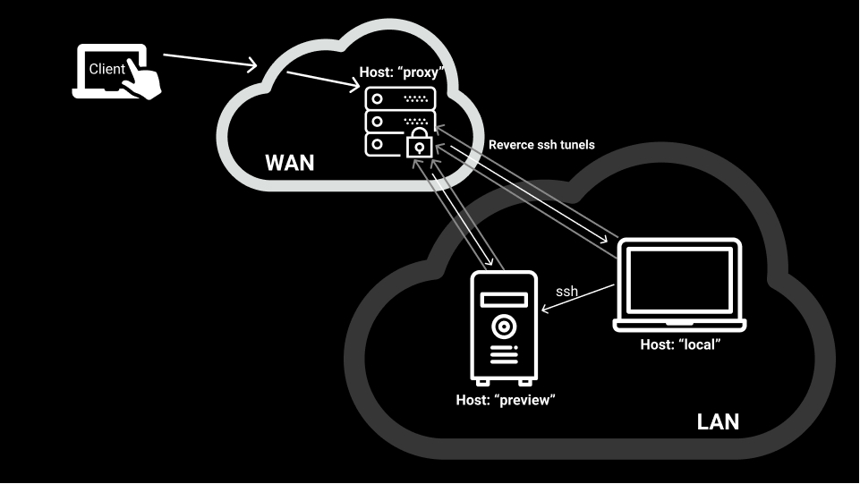

# Network: "preview"

Very narrow target network for previewing current work



## Install

Copy Configuration and amend it

```shell
cp hosts-example.yml hosts.yml
```

## Overview

### Groups

- proxy
- preview
- local

### Default Ansible configurations

```shell
cat /etc/ansible/ansible.cfg
```

### AdHoc Commands

```shell
# check connection with all hosts
ansible all -i hosts.yml -m ping 
# check connection with proxy group
ansible proxy -i hosts.yml -m ping 
# check distribution and ip4
ansible all -i hosts.yml -m setup -a "filter=*distribution*"
ansible all -i hosts.yml -m setup -a "filter=*ipv4*"
# check uptime
ansible all -i hosts.yml -m command -a "uptime"
# Display service facts
ansible all -i hosts.yml -m service_facts
```


### Check syntax before run
```shell
ansible-playbook -i hosts.yml playbook-proxy.yml --syntax-check
ansible-playbook -i hosts.yml playbook-preview.yml --syntax-check
```

